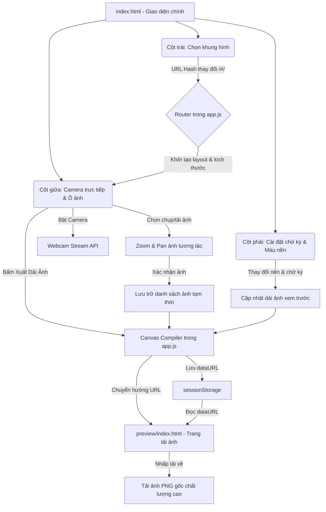

# 🌸 Apeach Photobooth - Web Chụp Ảnh Lấy Liền Hàn Quốc

Ứng dụng web chụp ảnh và tạo dải ảnh lấy liền (Photobooth) phong cách Hàn Quốc cực kỳ xinh xắn với chủ đề **Apeach (Kakao Friends)**. Ứng dụng hỗ trợ chụp ảnh trực tiếp từ webcam hoặc tải lên từ thiết bị, cho phép căn chỉnh kích thước (zoom/pan), tự chọn màu nền, chữ ký riêng và xuất ảnh chất lượng cao để in ấn với **11 loại bố cục (layout) tiêu chuẩn**.

---

## 🗺️ Sơ Đồ Cấu Trúc & Luồng Hoạt Động (Architecture & Flowchart)

Dưới đây là sơ đồ mô tả cấu trúc các thành phần giao diện và luồng truyền dữ liệu từ lúc người dùng thao tác chọn khung, chụp ảnh cho đến khi xuất ảnh chất lượng cao:



---

## ✨ Tính Năng Nổi Bật

### 📐 11 Layout Khung Hình Đa Dạng
Hỗ trợ đầy đủ các định dạng ảnh thẻ lấy liền thịnh hành nhất hiện nay:
*   **Kích thước dải dọc 2x6"**:
    *   **Kiểu A (3 ảnh):** Dải ảnh dọc ngắn, cân đối (`#/2x6-a`).
    *   **Kiểu B (4 ảnh - Mặc định):** Dải ảnh dọc 4 ô truyền thống (`#/2x6-b`).
*   **Kích thước thẻ 4x6"**:
    *   **Kiểu A:** Grid 6 ảnh nhỏ xinh (`#/4x6-a`).
    *   **Kiểu B:** 1 ảnh chân dung đơn (Portrait Single - `#/4x6-b`).
    *   **Kiểu C:** 1 ảnh phong cảnh đơn (Landscape Single - `#/4x6-c`).
    *   **Kiểu D:** 3 ảnh xếp ngang (`#/4x6-d`).
    *   **Kiểu E & Kiểu F:** Layout 3 ảnh nghệ thuật kiểu A/B (`#/4x6-e`, `#/4x6-f`).
    *   **Kiểu G:** Layout 4 ảnh xếp nghệ thuật (`#/4x6-g`).
    *   **Kiểu H & Kiểu I:** Layout 2 ảnh đứng/ngang ghép đôi (`#/4x6-h`, `#/4x6-i`).

### 📸 Chụp Ảnh Trực Tiếp & Tải Ảnh Linh Hoạt
*   Hỗ trợ bật/tắt camera trực tiếp từ trình duyệt kèm **hiệu ứng đếm ngược 3 giây** và **chớp nháy flash** sống động khi chụp.
*   Cho phép chọn tải ảnh cục bộ từ máy tính/điện thoại để ghép khung nếu không muốn dùng webcam.

### 🔍 Căn Chỉnh Ảnh Trong Ô (Zoom & Pan)
*   Sau khi chụp hoặc tải ảnh, người dùng có thể nhấp chuột/chạm và kéo rê ảnh (Pan) để lấy góc mặt đẹp nhất.
*   Thanh trượt Zoom thông minh cho phép phóng to/thu nhỏ ảnh mượt mà riêng biệt cho từng ô hình.

### 🎨 Tùy Biến Giao Diện Cá Nhân
*   **Màu nền dải ảnh:** Thay đổi màu nền giấy chụp ảnh tùy thích (Trắng, Đen, Hồng Apeach nhạt, Hồng Đậm, hoặc tự chọn màu bất kỳ từ Color Picker).
*   **Chữ ký/Lời chúc riêng:** Tự viết lời chúc, ngày kỷ niệm hiển thị ở góc chân trang dải ảnh.

### 🌐 Định Tuyến Hash Client-Side & Tự Động Lưu Trạng Thế
*   Sử dụng định tuyến URL dạng Hash (ví dụ: `/#/4x6-d`) giúp lưu giữ layout được chọn. Khi nhấn **F5 làm mới trang**, giao diện vẫn giữ đúng layout hiện tại mà không bị lỗi 404.
*   Xem trước kết quả xuất ảnh trên trang Preview chất lượng trước khi tải.

### 📱 Giao Diện Mobile Độc Đáo (Slide Drawer)
*   Thiết kế responsive hoàn hảo trên mọi thiết bị.
*   **Mobile layout:** Tích hợp nút menu ẩn `☰` nổi bật. Nhấp vào sẽ mở rộng danh sách layout chiếm **1/3 màn hình di động** trên một lớp nền phủ trong suốt chuyên nghiệp, tự động ẩn nút và đóng menu tiện lợi sau khi thao tác.

### 💾 Xuất Ảnh Chất Lượng Cao 
*   Bộ mã hóa canvas tự động chuyển tỷ lệ CSS sang tọa độ in ấn chất lượng cao (lên tới 1800x1200px cho thẻ 4x6" hoặc 1080x3348px cho dải dọc 2x6").
*   Chân trang tự vẽ logo Apeach trái tim, ngày tháng chụp và đường nét đứt phân cách sắc nét, chuyên nghiệp.

---

## 📂 Cấu Trúc Thư Mục Dự Án

```text
├── index.html            # Giao diện chính bốt chụp hình
├── style.css             # Định dạng CSS (Thiết kế Apeach, responsive, hiệu ứng cánh hoa bay)
├── app.js                # Xử lý logic nghiệp vụ, camera, zoom/pan ảnh, vẽ canvas xuất hình
├── apeach_footer.png     # Logo trái tim Apeach dùng dưới chân trang dải ảnh
├── favicon.png           # Biểu tượng của ứng dụng web
├── preview/
│   └── index.html        # Giao diện xem trước ảnh đã ghép trước khi tải
└── README.md             # Tài liệu hướng dẫn sử dụng (File này)
```

---

## 🛠️ Hướng Dẫn Chạy Cục Bộ (Local Deployment)

Do ứng dụng sử dụng webcam (API `navigator.mediaDevices.getUserMedia`) và lưu trữ tạm thời `sessionStorage`, bạn cần chạy ứng dụng qua một môi trường máy chủ cục bộ (Local Server) để đảm bảo quyền truy cập camera hoạt động chuẩn xác:

### Cách 1: Sử dụng Python (Đơn giản nhất)
Nếu máy bạn đã cài đặt Python, mở Terminal/PowerShell tại thư mục dự án và chạy lệnh:

```bash
# Đối với Python 3
python -m http.server 8000
```
Sau đó truy cập địa chỉ: **`http://localhost:8000/`** trên trình duyệt.

### Cách 2: Sử dụng Live Server trong VS Code
1.  Mở thư mục dự án bằng phần mềm **VS Code**.
2.  Cài đặt Extension **Live Server** (của nhà phát triển *Ritwick Dey*).
3.  Nhấp vào nút **Go Live** ở góc dưới cùng bên phải màn hình VS Code.
4.  Ứng dụng tự động chạy trên trình duyệt mặc định (thường là cổng `5500`).

---

## 🚀 Hướng Dẫn Sử Dụng Chi Tiết

1.  **Chọn Khung Hình:** Bấm vào nút `☰` góc trái (trên điện thoại) hoặc xem trực tiếp menu ở cột trái (trên máy tính) để chọn 1 trong 11 layout yêu thích.
2.  **Cho Phép Camera:** Nhấp nút **Bật Camera 📸** và xác nhận cho phép trình duyệt truy cập camera.
3.  **Lấy Hình Cho Từng Ô:**
    *   Nhấp chọn ô cần chụp/tải ảnh (ô đang chọn sẽ có viền sáng nhấp nháy màu hồng).
    *   Bấm **Chụp Ảnh 📸** (đếm ngược 3 giây) hoặc bấm **Tải Ảnh Lên 📤** để chọn ảnh từ máy.
    *   Kéo thả ảnh trong ô để dịch chuyển vị trí (Pan) và dùng thanh trượt để phóng to/thu nhỏ (Zoom).
    *   Bấm **Xác nhận 🤝** để khóa ảnh vào ô, hoặc **Hủy ❌** để chụp/tải lại.
4.  **Tùy Biến Thêm:** Điền lời đề tặng ở bảng tùy chỉnh bên phải và chọn màu nền mong muốn.
5.  **Tải Ảnh:** Bấm **Xuất Dải Ảnh 💾**. Trình duyệt sẽ chuyển hướng đến trang xem trước, tại đây bạn có thể nhấn **Tải Trực Tiếp 💾** hoặc nhấn giữ lâu vào ảnh và chọn "Lưu hình ảnh" để lưu về thiết bị.

---

## 💡 Công Nghệ Sử Dụng

*   **HTML5 Semantic Elements** (Bố cục cấu trúc chuẩn SEO).
*   **Vanilla CSS3** (Flexbox, Grid layout, Glassmorphism, CSS keyframe animations).
*   **Vanilla JavaScript (ES6+)** (MediaDevices API, Canvas API, SessionStorage, URL Hash Routing).
*   **Google Fonts** (Fredoka Rounded Font).

---

*Chúc bạn tạo ra thật nhiều dải ảnh kỷ niệm Apeach dễ thương và đáng nhớ! 🌸 Peach Petals Falling...*
